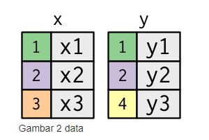

Dasar Relational Data set Di RStudio 
Penjelasan ini diambil dari laman https://rpubs.com/suhartono-uinmaliki/relational

```{r}
library(tidyverse)
library(nycflights13)
```
Perintah dalam dplyr (dibandingkan dengan perintah pada SQL) adalah sebagai berikut :

Fungsi dalam dplyr    |	Fungsi dalam SQL    |	Keterangan
------------------    | -----------------   | ------------
select()	            | SELECT	            | Menyeleksi kolom variabel
filter()              |	WHERE               |	Menyaring (filter) baris
group_by()            | GROUP_BY            |	Mengelompokkan data
summarise()           | tidak ada           |	Merangkum data
arrange()             | ORDER_BY	          | Mengurutkan data
mutate()              | COLUMN ALIAS        |	Membuat kolom baru
join()	              | JOIN	              | Menggabungkan data frame

Memahami join

Untuk membantu kita mempelajari cara kerja joins, kita akan menggunakan representasi visual:


Kolom berwarna  mewakili variabel “key”, variabel ini digunakan untuk mencocokkan baris pada tabel data set tersebut. Sedangkan untuk kolom abu-abu menunjukkan kolom “value”, variabel ini digunakan menjelaskan deskripsi tentang nilai pada variabel key pada tabel data set tersebut.

Untuk menciptakan tabel data set x dan tabel dataset y dengan menggunakan fungsi tribble(), fungsi ini digunakan untuk mnegatur tata letak baris demi baris yang lebih mudah dibaca. Ini berguna untuk tabel data kecil di mana keterbacaan nya penting.



```{r}
x <- tribble(
  ~key, ~val_x,
     1, "x1",
     2, "x2",
     3, "x3"
)
y <- tribble(
  ~key, ~val_y,
     1, "y1",
     2, "y2",
     4, "y3"
)
```
```{r}
x
```
```{r}
y
```
```{r}
x %>% 
  inner_join(y, by = "key")
```
```{r}
x <- tribble(
  ~key, ~val_x,
     1, "x1",
     2, "x2",
     3, "x3"
)
y <- tribble(
  ~key, ~val_y,
     1, "y1",
     2, "y2",
     4, "y3"
)
```

```{r}
left_join(x,y)
```

Contoh menggunakan dataset nycflight13  

```{r}
flights2 <- flights %>% 
  select(year:day, hour, origin, dest, tailnum, carrier)
flights2
#> # A tibble: 336,776 x 8
#>    year month   day  hour origin dest  tailnum carrier
#>   <int> <int> <int> <dbl> <chr>  <chr> <chr>   <chr>  
#> 1  2013     1     1     5 EWR    IAH   N14228  UA     
#> 2  2013     1     1     5 LGA    IAH   N24211  UA     
#> 3  2013     1     1     5 JFK    MIA   N619AA  AA     
#> 4  2013     1     1     5 JFK    BQN   N804JB  B6     
#> 5  2013     1     1     6 LGA    ATL   N668DN  DL     
#> 6  2013     1     1     5 EWR    ORD   N39463  UA     
#> # … with 336,770 more rows
```
```{r}
flights2 %>%
  select(-origin, -dest) %>% 
  left_join(airlines, by = "carrier")
#> # A tibble: 336,776 x 7
#>    year month   day  hour tailnum carrier name                  
#>   <int> <int> <int> <dbl> <chr>   <chr>   <chr>                 
#> 1  2013     1     1     5 N14228  UA      United Air Lines Inc. 
#> 2  2013     1     1     5 N24211  UA      United Air Lines Inc. 
#> 3  2013     1     1     5 N619AA  AA      American Airlines Inc.
#> 4  2013     1     1     5 N804JB  B6      JetBlue Airways       
#> 5  2013     1     1     6 N668DN  DL      Delta Air Lines Inc.  
#> 6  2013     1     1     5 N39463  UA      United Air Lines Inc. 
#> # … with 336,770 more rows
```

```{r}
right_join(x,y)
```
```{r}
full_join(x,y)
```
```{r}
x <- tribble(
  ~key, ~val_x,
     1, "x1",
     2, "x2",
     2, "x3",
     1, "x4"
)
y <- tribble(
  ~key, ~val_y,
     1, "y1",
     2, "y2"
)
```
```{r}
left_join(x, y, by = "key")
```
```{r}
x <- tribble(
  ~key, ~val_x,
     1, "x1",
     2, "x2",
     2, "x3",
     3, "x4"
)
y <- tribble(
  ~key, ~val_y,
     1, "y1",
     2, "y2",
     2, "y3",
     3, "y4"
)
left_join(x, y, by = "key")
```
```{r}
x <- tribble(
  ~key, ~val_x,
     1, "x1",
     2, "x2",
     3, "x3"
)
y <- tribble(
  ~key, ~val_y,
     1, "y1",
     2, "y2",
     4, "y3"
)
  semi_join(x, y, by = "key")
```
```{r}
x <- tribble(
  ~key, ~val_x,
     1, "x1", 
     2, "x2",
     2, "x3",
     3, "x4"
)
y <- tribble(
  ~key, ~val_y,
     1, "y1",
     2, "y2",
     2, "y3",
     3, "y4"
)
  semi_join(x, y, by = "key")
```
```{r}
x <- tribble(
  ~key, ~val_x,
     1, "x1",
     2, "x2",
     3, "x3"
)
y <- tribble(
  ~key, ~val_y,
     1, "y1",
     2, "y2",
     4, "y3"
)
  anti_join(x, y, by = "key")
```
```{r}
df1 <- tribble(
  ~x, ~y,
   1,  1,
   2,  1
)
df2 <- tribble(
  ~x, ~y,
   1,  1,
   1,  2
)
df1
```
```{r}
df2
```
```{r}
intersect(df1, df2)
```
```{r}
union(df1, df2)
```
```{r}
setdiff(df1, df2)
```
```{r}
setdiff(df2, df1)
```
```{r}

```

```{r setup, include=FALSE}
knitr::opts_chunk$set(echo = TRUE)
```
